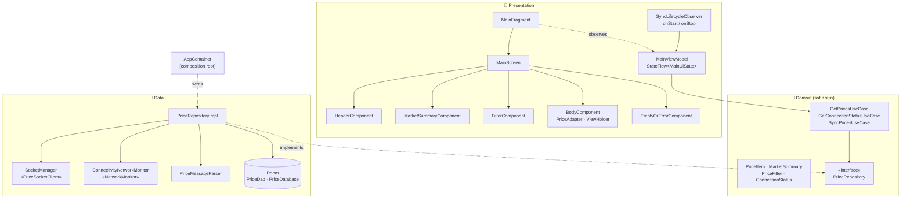

# InvestAZ — Canlı Bazar Qiymətləri

Bazar qiymətlərini real vaxt rejimində göstərən native Android tətbiqi. Məlumatlar **Socket.IO** ilə alınır, **Room**-da keşlənir və internet olmadıqda son qiymətlər göstərilir.

| Canlı (light) | Canlı (dark) | Oflayn — keşdən | Bağlantı yoxdur |
|:---:|:---:|:---:|:---:|
|  |  |  |  |

## Funksionallıq

- **Canlı qiymətlər:** `https://q.investaz.az` · path `/live` · event `message`
- **Bağlantı statusu:** `Qoşuldu` / `Qoşulur` / `Bağlıdır`
- **Bazar icmalı:** alət sayı, artan/azalan alətlər, bazar əhvalı göstəricisi
- **Filtrlər:** Hamısı / Artan / Azalan
- **Qiymət kartı:** Alış/Satış, spred, gündaxili diapazon (Low–High), qiymət dəyişəndə vizual vurğu
- **Oflayn rejim və avtomatik reconnect**, Light/Dark tema

## Texnologiyalar

| | |
|---|---|
| **Dil / Build** | Kotlin, AGP 9.3.3, Version Catalog, KSP |
| **SDK** | `minSdk 24` · `targetSdk 35` · `compileSdk 36` |
| **Real-time** | Socket.IO Java Client `1.0.2` |
| **Keş** | Room `2.8.4` |
| **Asinxronluq** | Coroutines + Flow / StateFlow |
| **UI** | ViewBinding, RecyclerView (`ListAdapter` + `DiffUtil`), Material 3 |
| **Arxitektura** | Clean Architecture, MVVM, Single Activity, manual DI (`AppContainer`) |
| **Test** | JUnit 4, kotlinx-coroutines-test |

## Arxitektura



**Məlumat axını (Single Source of Truth):** Socket → Parser → Room → `Flow` → ViewModel → UI. UI socket-dən birbaşa oxumur, yalnız Room-dan oxuyur.

- **domain:** biznes qaydaları (`MarketSummary`, `PriceFilter`, `PriceItem.rangePosition`) və repository interfeysi; Android-dən asılı deyil.
- **data:** socket, JSON parsing, Room keşi, şəbəkə monitorinqi.
- **presentation:** `MainFragment` cəmi 24 sətirdir. Ekran `UiComponent` müqaviləsinə əsaslanan kiçik komponentlərə bölünüb.

## Edge case-lər

- **Şəbəkə kəsilir / bərpa olunur:** `NetworkMonitor` socket-i dərhal bağlayır və yenidən açır. Tətbiq çökmür, keşdən göstərməyə davam edir.
- **Xətalı JSON:** heç vaxt exception atılmır. Xətalı payload və elementlər atlanır və loglanır.
- **Lifecycle:** socket yalnız ekran görünərkən açıqdır (`onStart`/`onStop`). Binding view lifecycle-dan kənarda saxlanılmır, buna görə memory leak yoxdur.
- **Threading:** şəbəkə və baza `Dispatchers.IO`-da, mapping `Dispatchers.Default`-da, render `Dispatchers.Main`-də işləyir.
- **Backpressure:** socket axını conflated-dir və yalnız son snapshot emal olunur. Dəyişməyən data bazaya yenidən yazılmır.

## Texniki qərar: Socket.IO `1.0.2`

Tapşırıqda `2.0.1` göstərilib. Lakin server **Socket.IO v2** protokolu ilə işləyir, `2.x` klienti isə yalnız v3/v4 serverlərlə uyğundur və qoşulmağı rədd edir:

```
It seems you are trying to reach a Socket.IO server in v2.x with a v3.x client, which is not possible
```

v2 server üçün uyğun klient `1.0.x`-dir. API eynidir, dəyişiklik yalnız `libs.versions.toml`-da bir sətirdir.

## İşə salma

```bash
git clone https://github.com/ChinaDevHub/investAZ.git
cd investAZ
./gradlew :app:installDebug
```

Testlər (parser, repository axını, biznes qaydaları, UI state):

```bash
./gradlew :app:testDebugUnitTest
```
