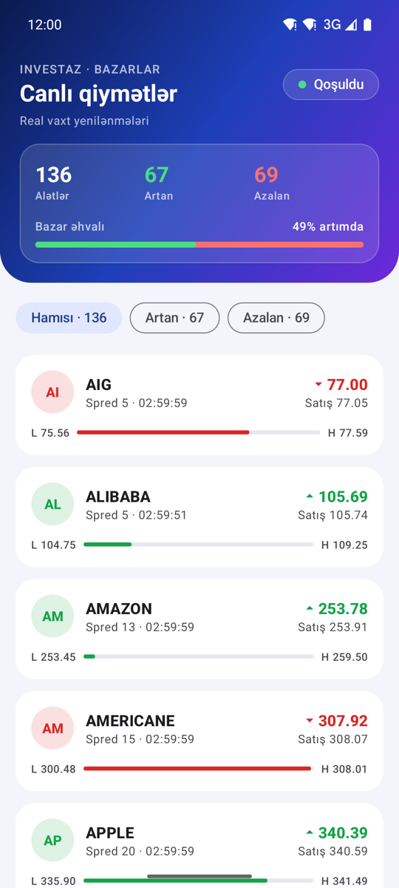
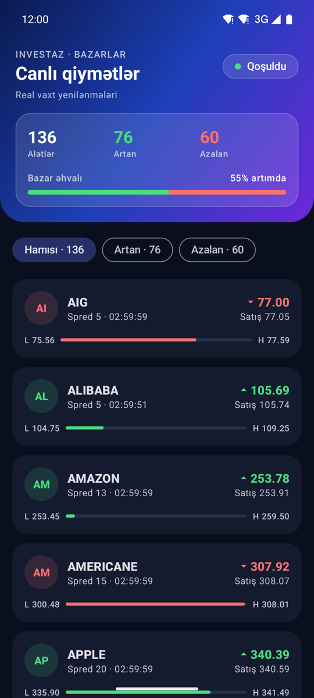
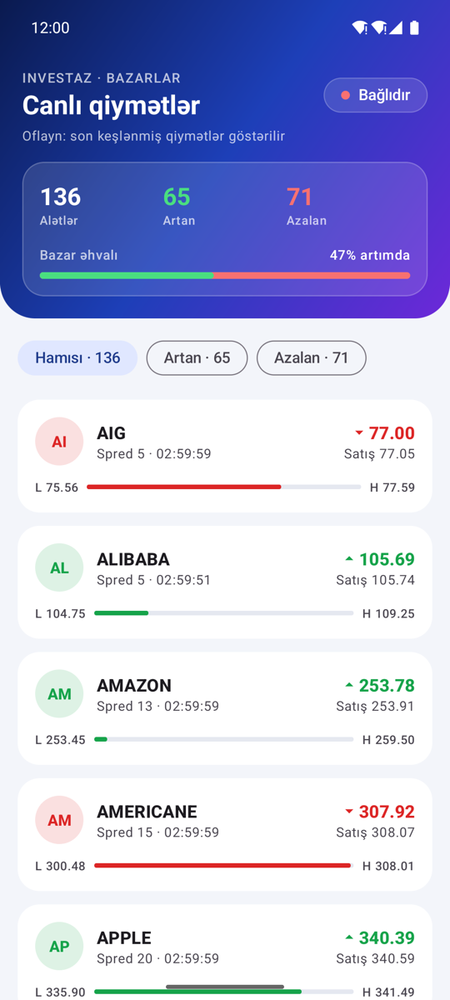
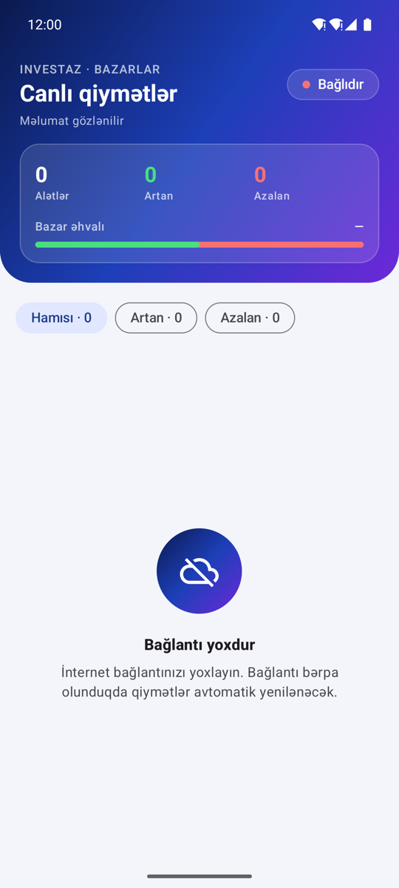
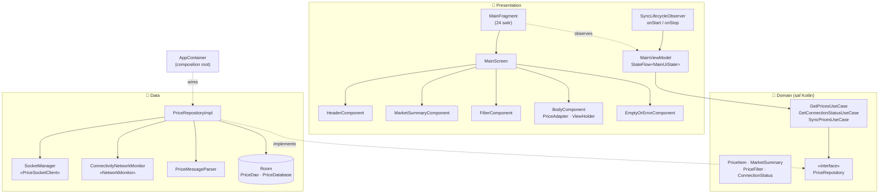
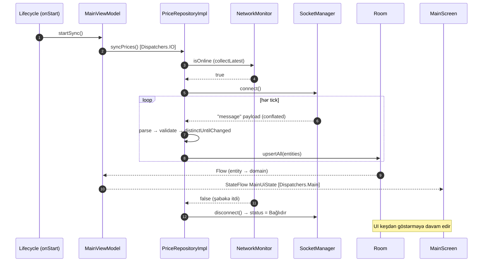

# InvestAZ — Canlı Bazar Qiymətləri

Real vaxt rejimində bazar qiymətlərini (valyuta cütləri, səhmlər, xammal, kriptovalyuta, indekslər) göstərən native Android tətbiqi. Məlumatlar **Socket.IO** ilə canlı axın şəklində alınır, **Room** bazasında keşlənir və internet olmadıqda da son qiymətlər göstərilir.

<p align="center">
  
  &nbsp;
  
  &nbsp;
  
  &nbsp;
  
</p>
<p align="center">
  <sub><b>Canlı (light)</b> · <b>Canlı (dark)</b> · <b>Oflayn — keşlənmiş qiymətlər</b> · <b>Bağlantı yoxdur, keş boşdur</b></sub>
</p>

---

## Mündəricat

- [Funksionallıq](#funksionallıq)
- [Texnologiyalar](#texnologiyalar)
- [Arxitektura](#arxitektura)
- [Məlumat axını](#məlumat-axını)
- [Layihə strukturu](#layihə-strukturu)
- [Edge case-lər və xətaların idarə olunması](#edge-case-lər-və-xətaların-idarə-olunması)
- [Mühəndislik prinsipləri](#mühəndislik-prinsipləri)
- [Texniki qərarlar](#texniki-qərarlar)
- [Testlər](#testlər)
- [Quraşdırma və işə salma](#quraşdırma-və-işə-salma)

---

## Funksionallıq

| Xüsusiyyət | Təsvir |
|---|---|
| **Canlı qiymətlər** | `https://q.investaz.az` (path `/live`, event `message`) üzərindən real vaxt rejimində yenilənmə |
| **Bağlantı indikatoru** | `Qoşuldu` / `Qoşulur` / `Bağlıdır` — rəngli status badge, reaktiv yenilənir |
| **Bazar icmalı** | Alətlərin ümumi sayı, artan / azalan alətlər, **bazar əhvalı** göstəricisi (artanların payı) |
| **Filtrlər** | `Hamısı` / `Artan` / `Azalan` — canlı saylarla |
| **Qiymət kartı** | Alış (bid) və Satış (ask), spred, son yenilənmə vaxtı, **gündaxili diapazon** (qiymətin Low–High arasındakı mövqeyi) |
| **Tick animasiyası** | Qiymət dəyişəndə qısa vizual vurğu (DiffUtil payload) |
| **Oflayn rejim** | İnternet olmadıqda Room-dan son keşlənmiş qiymətlər göstərilir |
| **Avtomatik bərpa** | Şəbəkə qayıdan kimi yenidən qoşulur, istifadəçi müdaxiləsi lazım deyil |
| **Light / Dark** | Tam dəstək; Material 3 + brend gradient dizayn sistemi |

---

## Texnologiyalar

| Kateqoriya | Texnologiya | Versiya |
|---|---|---|
| Dil | Kotlin (AGP built-in Kotlin) | — |
| Build | Android Gradle Plugin, Gradle Version Catalog | 9.3.3 |
| SDK | `minSdk` 24 · `targetSdk` 35 · `compileSdk` 36 | — |
| Real-time | Socket.IO Java Client (`io.socket:socket.io-client`) | 1.0.2 |
| Lokal baza | Room (runtime, ktx, compiler via **KSP**) | 2.8.4 |
| Asinxronluq | Kotlin Coroutines + Flow / StateFlow | 1.10.2 |
| Arxitektura komponentləri | ViewModel, Lifecycle (`repeatOnLifecycle`, `DefaultLifecycleObserver`) | 2.10.0 |
| UI | ViewBinding, RecyclerView + `ListAdapter`/`DiffUtil`, Fragment KTX | 1.4.0 / 1.8.9 |
| Dizayn | Material Components (Material 3) | 1.14.0 |
| Test | JUnit 4, kotlinx-coroutines-test, org.json (JVM) | — |

> **DI:** Kiçik layihə üçün Hilt/Koin əlavə etmək əvəzinə əl ilə **composition root** (`AppContainer`) istifadə olunub. Konkret implementasiyaları yalnız o tanıyır, qalan kod interfeyslərdən asılıdır. Lazım olduqda Hilt-ə keçid yalnız `di/` paketinə toxunur.

---

## Arxitektura

Layihə **Clean Architecture** üzrə üç qata bölünüb. Asılılıqlar yalnız içəriyə, `domain` qatına doğru yönəlir. `domain` Android-dən tam asılı deyil və saf Kotlin-dir.



### Qatların məsuliyyəti

| Qat | Məsuliyyət | Əsas klasslar |
|---|---|---|
| **domain** | Biznes modelləri və qaydaları; repository müqaviləsi; use case-lər | `PriceItem.rangePosition`, `MarketSummary.from()`, `PriceFilter.matches()`, `PriceRepository` |
| **data** | Socket bağlantısı, JSON parsing, Room keşi, şəbəkə monitorinqi, mapper-lər | `SocketManager`, `PriceMessageParser`, `PriceDao`, `PriceRepositoryImpl`, `ConnectivityNetworkMonitor` |
| **presentation** | UI state, render, istifadəçi hadisələri, lifecycle | `MainViewModel`, `MainUiState`, `MainScreen`, `*Component`, `PriceAdapter` |

### Komponentləşdirilmiş UI

`MainFragment` heç bir view məntiqi saxlamır. O, yalnız ekranı qurur, lifecycle observer-i bağlayır və state-i komponentlərə ötürür:

```kotlin
override fun onViewCreated(view: View, savedInstanceState: Bundle?) {
    super.onViewCreated(view, savedInstanceState)
    val screen = MainScreen(FragmentMainBinding.bind(view), viewModel::onFilterSelected)
    viewLifecycleOwner.lifecycle.addObserver(SyncLifecycleObserver(viewModel))
    viewLifecycleOwner.collectOnStarted(viewModel.uiState, screen::render)
}
```

Hər komponent eyni `UiComponent<MainUiState>` müqaviləsini implementasiya edir və yalnız öz layout-una cavabdehdir. Yeni bölmə əlavə etmək üçün `MainScreen`-də siyahıya bir komponent əlavə etmək kifayətdir (**Open/Closed**).

---

## Məlumat axını

**Single Source of Truth** prinsipi tətbiq olunur: UI heç vaxt socket-dən birbaşa oxumur. Socket-dən gələn hər şey əvvəlcə Room-a yazılır, UI isə yalnız Room-dan reaktiv `Flow` kimi oxuyur.



**Server payload formatı** (hər mesaj tam snapshot-dır):

```json
{ "result": [ { "0": "up", "1": "APPLE", "2": "340.39", "3": "340.59", "4": "335.90", "5": "341.49", "6": 20, "7": "2026-10-08T22:59:59.000Z" } ] }
```

| Açar | `0` | `1` | `2` | `3` | `4` | `5` | `6` | `7` |
|---|---|---|---|---|---|---|---|---|
| Məna | istiqamət | simvol | alış (bid) | satış (ask) | gündaxili min | gündaxili max | spred | vaxt (ISO-8601) |

---

## Layihə strukturu

```
app/src/main/java/com/example/investaz/
├── InvestAzApp.kt                    # Application — AppContainer-in sahibi
├── MainActivity.kt                   # Single Activity, edge-to-edge
├── di/
│   ├── AppContainer.kt               # DI müqaviləsi
│   └── DefaultAppContainer.kt        # Composition root
├── domain/
│   ├── model/                        # PriceItem, MarketSummary, PriceFilter, PriceDirection, ConnectionStatus
│   ├── repository/PriceRepository.kt
│   └── usecase/                      # GetPrices, GetConnectionStatus, SyncPrices
├── data/
│   ├── remote/                       # SocketManager, PriceSocketClient, SocketConfig, dto/, parser/
│   ├── local/                        # PriceDatabase, dao/PriceDao, entity/PriceEntity
│   ├── network/                      # NetworkMonitor, ConnectivityNetworkMonitor
│   ├── mapper/                       # DTO → Entity → Domain, ISO timestamp parser
│   └── repository/PriceRepositoryImpl.kt
└── presentation/
    ├── common/                       # UiComponent, SyncLifecycleObserver, Lifecycle/Insets/View extension-ları
    └── main/
        ├── MainFragment.kt · MainScreen.kt · MainViewModel.kt · MainUiState.kt · MainViewModelFactory.kt
        ├── components/               # Header, MarketSummary, Filter, Body, EmptyOrError
        ├── adapter/                  # PriceAdapter, PriceViewHolder, PriceDiffCallback, PriceListSetup
        ├── mapper/PriceUiMapper.kt
        └── model/                    # PriceUiModel, StatusBadge, Placeholder
```

Resurslar da modulyardır: `fragment_main.xml` yalnız `<include>`-lardan ibarətdir (`layout_header`, `layout_market_summary`, `layout_stat`, `layout_filters`, `layout_body`, `layout_empty_or_error`). Rənglər, ölçülər və stillər isə token kimi `colors.xml`, `dimens.xml` və `styles.xml`-dadır.

---

## Edge case-lər və xətaların idarə olunması

| Ssenari | Davranış | Harada |
|---|---|---|
| **Şəbəkə qırılır** | Socket dərhal bağlanır, status `Bağlıdır` olur, UI keşdən göstərməyə davam edir. Crash olmur. | `ConnectivityNetworkMonitor` + `collectLatest` |
| **Şəbəkə bərpa olunur** | Backoff gözlənilmədən dərhal yenidən qoşulur | `PriceRepositoryImpl.syncPrices()` |
| **Server tərəfli qırılma** | Socket.IO-nun eksponensial backoff ilə sonsuz reconnect-i (1s → 5s) | `SocketConfig` |
| **Wi-Fi ↔ mobil data keçidi** | Köhnə şəbəkənin gec gələn `onLost` siqnalı nəzərə alınmır, yalnız cari default şəbəkə izlənir | `ConnectivityNetworkMonitor` |
| **WebSocket bloklanıb** | Long-polling ilə başlayır, mümkün olduqda WebSocket-ə keçir | Engine.IO default transport-ları |
| **Xətalı / null JSON** | Heç vaxt exception atmır: xətalı payload boş siyahı qaytarır, xətalı element atlanır, hər ikisi loglanır | `PriceMessageParser` |
| **Gözlənilməz sync xətası** (məs. disk) | `catch` ilə tutulur və loglanır, tətbiq çökmür | `PriceRepositoryImpl` |
| **Oflayn və keş boş** | "Bağlantı yoxdur" ekranı | `MainUiState.placeholder` |
| **Filtrə uyğun alət yoxdur** | "Uyğun alət yoxdur" ekranı | `Placeholder.NO_MATCHES` |
| **Yavaş UI (backpressure)** | Socket axını `CONFLATED`: yalnız ən son snapshot emal olunur | `SocketManager.messages()` |
| **Eyni snapshot təkrarlanır** | `distinctUntilChanged`: bazaya artıq yazma olmur | `PriceRepositoryImpl` |
| **Qiymət dəqiqliyi** | Qiymətlər `TEXT` / `BigDecimal` kimi saxlanır, `0.99240` sıfırlarını itirmir | `PriceEntity`, `PriceItem` |
| **Anomal qiymət** (bid > high) | Diapazon mövqeyi 0..1 aralığında clamp olunur | `PriceItem.rangePosition` |

### Lifecycle və memory leak qorunması

- Socket bağlantısı `SyncLifecycleObserver` vasitəsilə **yalnız ekran görünən zaman** (`onStart` → `onStop`) açıq olur.
- Observer və state collector `viewLifecycleOwner`-ə bağlıdır. Binding Fragment-də sahə kimi saxlanılmır, buna görə view məhv olanda heç nə yaddaşda qalmır.
- Sync coroutine-i `viewModelScope`-dadır. `stopSync()` onu ləğv edir, `onCompletion` isə socket-i bağlayır (structured concurrency).

### Threading

| Əməliyyat | Dispatcher |
|---|---|
| Socket, parsing, Room yazma/oxuma | `Dispatchers.IO` (inject olunur) |
| Domain → UI mapping, filtrləmə | `Dispatchers.Default` (inject olunur) |
| View render | `Dispatchers.Main` (`lifecycleScope` + `repeatOnLifecycle`) |

---

## Mühəndislik prinsipləri

| Prinsip | Tətbiqi |
|---|---|
| **S**ingle Responsibility | Hər klassın bir işi var: `PriceMessageParser` yalnız parse edir, `SocketManager` yalnız bağlantını idarə edir, hər UI komponenti yalnız öz bölməsini render edir |
| **O**pen/Closed | Yeni UI bölməsi `UiComponent` kimi əlavə olunur, mövcud kod dəyişmir |
| **L**iskov Substitution | `PriceSocketClient`, `NetworkMonitor`, `PriceDao` testlərdə fake-lərlə əvəz olunur |
| **I**nterface Segregation | Kiçik, fokuslanmış interfeyslər: `SyncController` (2 metod), `NetworkMonitor` (1 property) |
| **D**ependency Inversion | Repository interfeysi domain-dədir, data onu implementasiya edir. ViewModel konkret klasslardan yox, use case-lərdən asılıdır |
| **DRY** | Dizayn tokenləri və stillər bir yerdədir, `layout_stat.xml` üç dəfə təkrar istifadə olunur, `collectOnStarted` və `applySystemBarsPadding` extension-ları |
| **KISS** | Kitabxanasız DI, sadə `enum` state-lər, sabit header (yığılan header-in mürəkkəbliyi yoxdur) |
| **SSOT** | Room yeganə məlumat mənbəyidir |

---

## Texniki qərarlar

### 1. Socket.IO client versiyası: `1.0.2` (`2.0.1` əvəzinə)

Tapşırıqda `socket.io-client:2.0.1` göstərilib. Lakin `q.investaz.az/live` serveri **Socket.IO v2 (Engine.IO v3)** protokolu ilə işləyir. `2.x` Java klienti isə yalnız v3/v4 serverlərlə uyğundur və v2 serverə qoşulmağı özü rədd edir:

```
SocketIOException: It seems you are trying to reach a Socket.IO server in v2.x with a v3.x client, which is not possible
```

Bu, hər iki versiya ilə real serverə qarşı yoxlanılıb. Socket.IO v2 serveri üçün rəsmi uyğun klient **`1.0.x`** xəttidir. API eynidir (`IO.Options`, `Socket.EVENT_*`, `Manager.EVENT_RECONNECT_ATTEMPT`), ona görə dəyişiklik yalnız `gradle/libs.versions.toml`-da bir sətirdir. Server v4-ə yenilənərsə, `2.x`-ə keçid kod dəyişikliyi tələb etmir.

### 2. `core-ktx` `1.17.0`

`1.19.x` `compileSdk 37` tələb edir. Tapşırıqdakı `compileSdk 36` tələbinə əməl etmək üçün uyğun son versiya seçilib.

### 3. Şəbəkə monitorinqi

Socket.IO ölü TCP bağlantısını yalnız ping timeout ilə aşkarlayır (bu serverdə ~85 saniyə). `ConnectivityManager` əsaslı `NetworkMonitor` bu müddəti ~1-3 saniyəyə endirir. Status da həqiqəti dərhal əks etdirir.

### 4. Kitabxanasız DI

Bir ekranlı tətbiq üçün Hilt-in annotation processing yükü əsassızdır. `AppContainer` interfeysi testlərdə əvəzlənə bilir, gələcəkdə miqrasiya isə lokal qalır.

---

## Testlər

JVM unit testləri (emulyator lazım deyil):

| Test sinfi | Nəyi yoxlayır |
|---|---|
| `PriceMessageParserTest` | Düzgün parse; xətalı elementlərin atlanması; boş, `null`, səhv tipli payload-larda crash olmaması |
| `PriceRepositoryImplTest` | Socket → Room → Flow axını (SSOT); sync dayandırılanda socket-in bağlanması; şəbəkə itəndə və qayıdanda davranış; oflayn keş |
| `MarketRulesTest` | Bazar icmalı və əhval faizi; filtrlər; diapazon mövqeyinin clamp-ı və boş diapazon |
| `MainUiStateTest` | Hansı vəziyyətdə hansı placeholder-in göstərilməsi |

```bash
./gradlew :app:testDebugUnitTest
```

---

## Quraşdırma və işə salma

**Tələblər:** Android Studio (AGP 9.3 dəstəyi ilə), Android SDK 36. JDK Gradle toolchain tərəfindən avtomatik təmin olunur.

```bash
git clone <repo-url>
cd InvestAZ
./gradlew :app:installDebug
```

Diaqnostika üçün tətbiq logları:

```bash
adb logcat -s SocketManager PriceRepository ConnectivityMonitor PriceMessageParser
```
